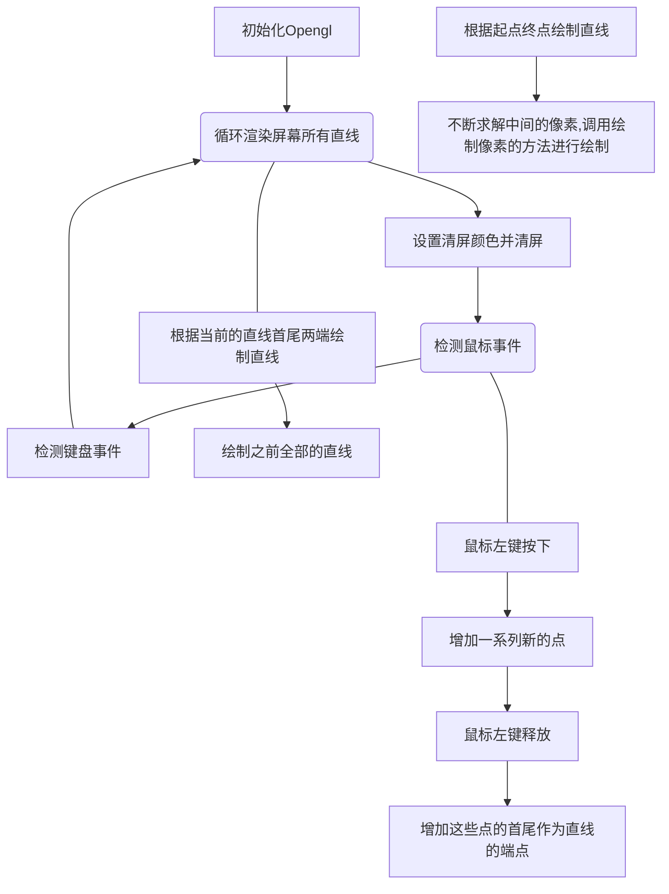

主程序

```mermaid
graph TD;
初始化Opengl-->a(循环渲染屏幕所有直线)
a-->设置清屏颜色并清屏-->b(检测鼠标事件)-->检测键盘事件-->a
b----鼠标左键按下-->增加一系列新的点-->鼠标左键释放-->增加这些点的首尾作为直线的端点
a----根据当前的直线首尾两端绘制直线-->绘制之前全部的直线
根据起点终点绘制直线-->不断求解中间的像素,调用绘制像素的方法进行绘制
```

检测鼠标事件

